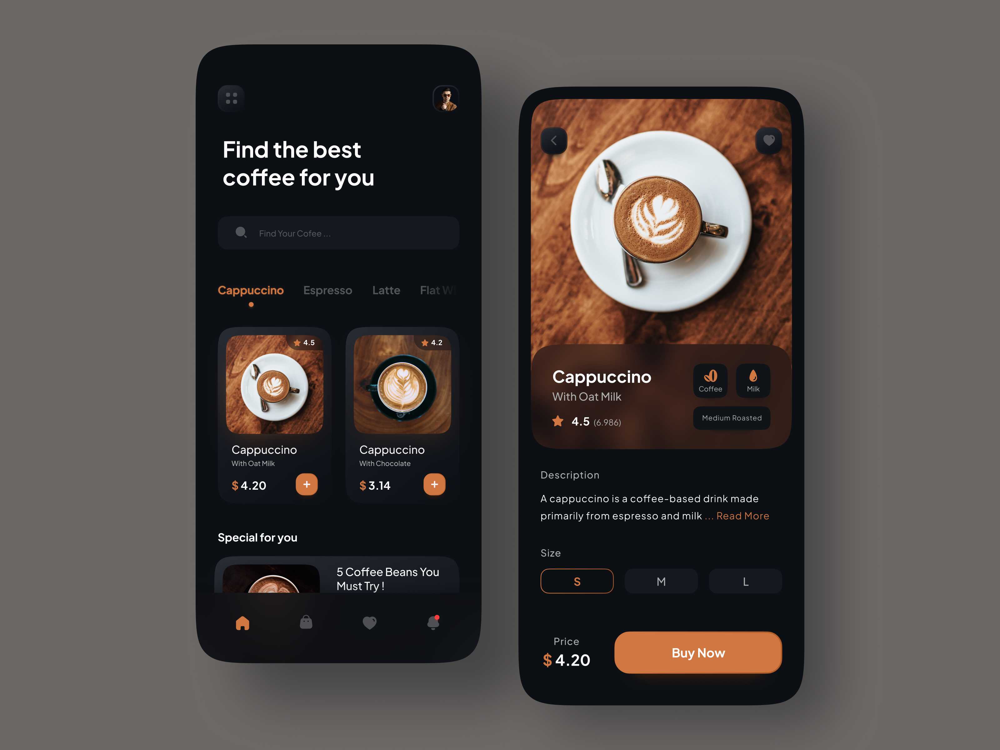

# Coffee App ☕️
A sleek and user-friendly coffee app developed using **Expo** and **React Native**. This app is designed to provide users with an intuitive interface to browse coffee options, customize their orders, and experience a delightful UI.

---



## Features ✨

- 📋 **Menu Display**: Browse an extensive coffee menu with details for each item.
- ☕ **Customization**: Customize your coffee order to match your taste.
- 🎨 **Modern UI/UX**: Enjoy a beautifully designed and responsive interface.
- 📱 **Cross-Platform Support**: Fully optimized for both Android and iOS devices.
- 📂 **Six Screens**:
  - **Home Screen**: View the main menu and explore coffee options.
  - **Favorites Screen**: Save and view your favorite coffee selections.
  - **Cart Screen**: Manage your selected items for purchase.
  - **Order History Screen**: Track your previous orders.
  - **Payment Screen**: Complete the checkout process seamlessly.
  - **Details Screen**: View detailed information about specific coffee items.

---

## Installation 🛠️

Follow these steps to get the app up and running locally:

1. Clone the repository:
   ```bash
   git clone https://github.com/Jabweli/react-native-coffee-app.git

2. Navigate to the project directory

   ```bash
   cd react-native-coffee-app
   ```

3. Install dependencies

   ```bash
   npm install
   ```

4. Start the app

   ```bash
    npx expo start
   ```
   
## Technologies Used 🛠️

- React Native: For building the mobile app.
- Expo: For rapid development and easy cross-platform deployment.
- Zustand: Lightweight state management for handling app-wide state.
- JavaScript: The core language for the app.
- Custom Hooks and Components: For reusable and modular code.


